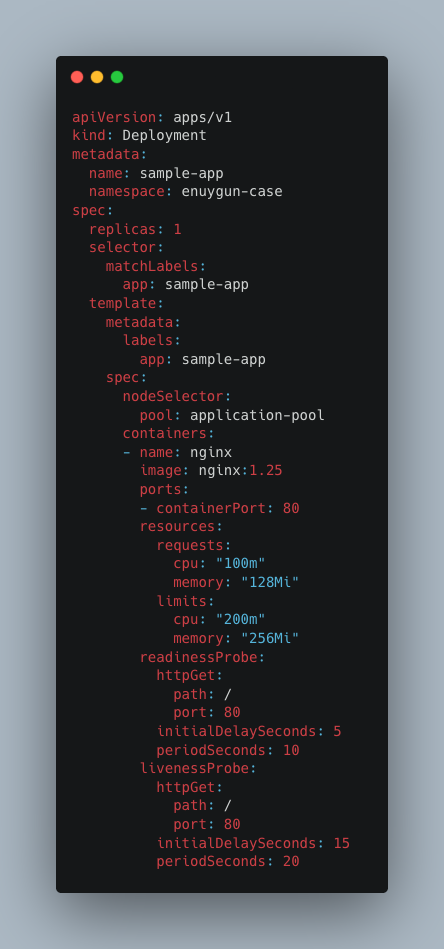

# Kubernetes Case Study - Enuygun

## Proje Yapısı

```

├── k8s/                    # Kubernetes manifest dosyaları
├── main.tf                 # Ana Terraform yapılandırması
├── kubernetes.tf           # GKE küme yapılandırması
├── monitoring.tf           # Prometheus, Grafana ve alertmanager kurulumu
├── keda.tf                 # KEDA kurulumu ve node scaling yapılandırması
├── istio.tf                # Istio servis mesh kurulumu
├── deployments.tf          # Sample app, load generator ve benzeri manifest dosyalarının deploymentı
├── variables.tf            # Terraform değişkenleri
```

### Case'ler ve Çözümleri

##### 1. Google Kubernetes Engine kullanılarak bir Kubernetes cluster oluşturulmalıdır. Cluster ın logging ve monitoring özellikleri disable edilmelidir.

* [kubernetes.tf'e bu yazıya tıklayarak erişebilirsiniz](kubernetes.tf). GKE ile yeni bir Kubernetes cluster oluşturup bu cluster'ın default node pool'unu sildim. Logging ve Monitoring ayarlarının disable olması için konfigürasyon sırasında boş tanımladım.


#####  2. 2 adet node pool açılmalıdır. 1. node pool un adı main-pool 2. node pool un adı application-pool olmalıdır. Bu nodepool’lar açılırken n2d makina type kullanılmalı ve cluster europe-west-1 region da açılmalıdır. main-pool da auto scaling kapalı olurken application-pool un 1 - 3 node arasında auto scaling yapması sağlanmalıdır.

* [kubernetes.tf'e bu yazıya tıklayarak erişebilirsiniz](kubernetes.tf). n2d-standard-2 type makineler ile europe-west-1 zone'unda 2 adet node açtım. main-pool'un tek node çalışması için sabit bir zone tanımladım. application_pool node'unu en az 1 en çok 3 node çalışacak çekilde konfigüre ettim.


#####  3. Cluster üzerine YAML manifest kullanarak örnek bir Kubernetes uygulaması deploy edilmeli ve bu uygulamanın sadece application-pool üzerinde çalışması sağlanmalıdır.

* [Yaml'a bu yazıya tıklayarak erişebilirsiniz](k8s/sample-app/deployment.yaml). NodeSelector ile sadece aplication-pool pool'u üzerinde çalışması sağlandı.



#####  4. Deploy edilen bu uygulamada HPA aktifleştirilmelidir. CPU kullanımı %25'in üzerinde olursa deployment 1 - 3 pod arası scale olması sağlanmalıdır.

* [Yaml'a bu yazıya tıklayarak erişebilirsiniz](k8s/sample-app/hpa.yaml). Pod %25 cpu usage üzerine çıktığında maximum 3 pod olacak şekilde 1-3 arasında cpu autoscale edilmesi sağlandı. Buna ek olarak bir [load generator](k8s/sample-app/load-generator.yaml) yazarak load'u simüle ederek çalıştığını test ettim.


#####  5. Cluster üzerinde Prometheus ve Grafana kurulumu yapılmalı ve Kubernetes metriklerinin prometheus a aktarılması sağlanmalıdır.

* [monitoring.tf'e bu yazıya tıklayarak erişebilirsiniz](monitoring.tf). Monitoring için yeni bir namespace oluşturup sonra da kurulum ve konfigürasyonu yapıldı. Grafana UI üzerinden data sources kontrol ettiğimizde bu şekilde görünüyor.


#####  6. Grafana üzerinden pod restart alarmı kurulmalıdır.

* [monitoring.tf'e bu yazıya tıklayarak erişebilirsiniz](monitoring.tf). Alert için sample_app_service_monitor isimli bir servis monitorü oluşturuldu. enuygun-case namespace'indeki podların restartının izlenmesi için pod_restart_alerts isimli bir alert oluşturuldu. 5 dakika içerisinde 30 saniyeden fazla pod restartı olduğunda tetiklenip alert oluşturuyor.


#####  7. Cluster a keda kurulumu yapılmalı ve 4. madde keda kullanılarak da yapılabilmelidir.

* [keda.tf'e bu yazıya tıklayarak erişebilirsiniz](keda.tf). Keda kurulumundan sonra basit konfigürasyonlarla cpu kullanım oranına bağlı olarak %25'i aştığı durumda maksimum 3 node olacak şekilde konfigüre edildi. Çalıştığını aşağıdaki görselden görebiliyoruz.


#####  8. Cluster a istio kurulumu yapılmalıdır. (istiod, istio-ingress, istio-egress)

* [istio.tf'e bu yazıya tıklayarak erişebilirsiniz](istio.tf). istio kurulumunu yapmak için öncelikle istio base kurulumu yapıp ondan sonra da istiod, istio-ingress  ve istio-egress kurulumlarını yaptım. istio-system ve istio-ingress adında iki farklı namespace üzerinde çalışmakta.

